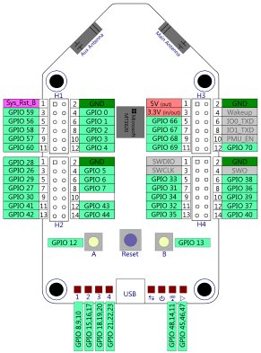
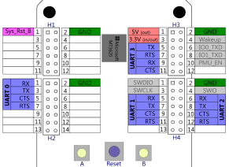
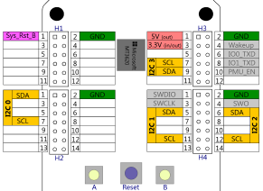
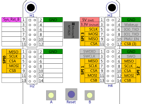

# AzureSphereSamples
This repo contains sources and links for Azure Sphere Bootcamp labs, amongst others 
Azure Sphere Samples for connected MCU and DHT sensor.

Prerequisites:
Please make sure to have a Windows 10 laptop capable of running Visual Studio 2019 or Visual Studio 2017 (at least Visual Studio 
CS Community Edition v15.9 or newer) with Azure Sphere SDK already installed and a free
USB port available. 
* Visual Studio 2019 Download: https://visualstudio.microsoft.com/vs/
* Azure Sphere SDK: https://aka.ms/azurespheresdkdownload

Although the SDK package is ~150MB, during the installation it may download up to 1GB of Visual Studio 
Components, so we strongly recommend to have the SDK preinstalled.

You will also need an active Azure subscription and a user account with subscription admin rights to add 
Enterprise Application entries to your Azure Active Directory and create Azure Resources such as 
* Azure Resource Groups 
* [Azure IoT Hub](https://docs.microsoft.com/en-us/azure/iot-hub/about-iot-hub) 
* [Azure IoT Hub Device Provisioning Service](https://docs.microsoft.com/en-us/azure/iot-dps/about-iot-dps)
amongst others potentially.

To follow the code samples please clone the following GitHub repositories:
* [This repo](https://github.com/JuergenSchwertl/AzureSphereSamples)
* [The Azure Sphere Samples Repo](https://github.com/Azure/azure-sphere-samples/)

## Lab Getting started
Please follow the steps as outlined in [Install Azure Sphere](https://docs.microsoft.com/en-us/azure-sphere/install/overview)
* [Install the Azure Sphere SDK](https://docs.microsoft.com/en-us/azure-sphere/install/install) and set up your development board
* [Install the latest Azure Sphere OS release](https://docs.microsoft.com/en-us/azure-sphere/install/install-os)
* [Set up an account](https://docs.microsoft.com/en-us/azure-sphere/install/azure-directory-account) to authenticate with Microsoft Azure
* [Claim your device](https://docs.microsoft.com/en-us/azure-sphere/install/claim-device)
* [Configure Wi-Fi](https://docs.microsoft.com/en-us/azure-sphere/install/configure-wifi)

**Please note**
> If you setup your account to create an Azure Sphere tenant, you will need to use a user account in your own Azure Active Directory.
> I.e. if you accidentally choose your Microsoft Account ( myname@outlook.com ) it would try to create a tenant in the Outlook.com directory
> where you likely won't have sufficient user permissions to add Enterprise Applications!
> If you choose to use your corporate account, make sure your AAD administrator has setup your account with the appropriate permissions.

Please follow the steps outlined in [Quickstart: Build the Blink sample application](https://docs.microsoft.com/en-us/azure-sphere/quickstarts/qs-blink-application) 
to prepare your Azure Sphere Board for development sideloading and build your first application.

## Lab #1: Setup Azure IoT Hub and Azure IoT Hub Device Provisioning Service
Please follow the steps as outlined in [Set up an IoT Hub for Azure Sphere](https://docs.microsoft.com/en-us/azure-sphere/app-development/setup-iot-hub).

## Lab #2: Azure IoT Hub connected Azure Sphere Application
**Pls note**
> The 19.02 version of the Azure Sphere SDK contained the "Azure IoT Hub Sample for Mt3620 RDB (Azure Sphere)" application template. Since this 
> application template is no longer available in the 19.05 version of the SDK I've thus included it here as a ready made project.
> For the next lab you'll therefore need [this repo](https://github.com/JuergenSchwertl/AzureSphereSamples) cloned.

Please follow the steps outlined in [Azure IoT Hub Sample for Mt3620 RDB (Azure Sphere)](./Mt3620AzureIoTHub) to connect Azure Sphere to Azure IoT Hub.

## Lab #3: Connecting a DHT sensor and send telemetry to Azure IoT Hub
Please follow the steps as outlined in [Mt3620DirectDHT](./Mt3620DirectDHT)
to connect the DHT sensor and send telemetry data. It also contains hints to extend the ePoll event_data_t structure to enable event context handling.

## Lab #4: Connecting another MCU through UART
In this lab we'll connect a NodeMCU sending telemetry data through UART to Azure Sphere acting as a cloud gateway.

Please follow the steps as outlined in [MCUtoMt3620ToAzure](./MCUtoMT3620toAzure) to run this lab.

## Lab #5: Bluetooth provisioning of WiFi Credentials
For this lab you'll need the Azure Sphere Teams [Azure Sphere Samples repo](https://github.com/Azure/azure-sphere-samples/) cloned.

Please follow the steps as outlined in [WifiSetupAndDeviceControlViaBle](https://github.com/Azure/azure-sphere-samples/tree/master/Samples/WifiSetupAndDeviceControlViaBle) 
to connect the [Nordic Semiconductor nRF52 Development Kit](https://www.nordicsemi.com/Software-and-Tools/Development-Kits/nRF52-DK)

## Lab #6: Updating an external MCU Firmware
For this lab you'll need the Azure Sphere Teams [Azure Sphere Samples repo](https://github.com/Azure/azure-sphere-samples/) cloned.

Please follow the steps as outlined in [External MCU Update](https://github.com/Azure/azure-sphere-samples/tree/master/Samples/ExternalMcuUpdateNrf52) 
which uses the same [Nordic Semiconductor nRF52 Development Kit](https://www.nordicsemi.com/Software-and-Tools/Development-Kits/nRF52-DK).

## Lab #7: Connecting an I2C sensor (Bosch BME280) and send telemetry to Azure IoT Central
For the next lab we'll need [this repo](https://github.com/JuergenSchwertl/AzureSphereSamples) cloned.
Please follow the steps as outlined in [Mt3620DirectDHT.pdf](https://github.com/JuergenSchwertl/AzureSphereSamples/blob/master/Mt3620DirectDHT/MT3620DirectDHT.pdf)
to connect the DHT sensor and send telemetry data. It also contains hints to extend the ePoll event_data_t structure to enable event context handling.

# Mt3620 Development Board pinouts
Most of the IO options on Azure Sphere are multiplexed between different functions.
For reference pls. find the different functional pinouts below:

## GPIOs

## ISU blocks
Azure Sphere has 4 so called ISU-Blocks (**I**2C, **S**PI, **U**ART) for serial communication with peripherals.

For your reference pls. find the pinouts of the I2C, SPI and UART for the Azure Sphere Development Board below:

### UART pinout
Azure Sphere allows Universal asynchronous receiver-transmitter communication either in software 
flow control using a three-wire connection (TX->RX & RX<-TX crossed, Gnd) or with hardware flow control 
additionally using RTS/CTS.

Pls. keep in mind that Azure Sphere runs on 3.3V ! 

To raise voltage levels to standard RS232 levels (+/-15V) or when connecting to a 5V based 
MCU such as the Arduino UNO you'll need level shifters, otherwise you'll eventually fry the Sphere chip.  

### I2C pinout

### SPI pinout

# Disclaimer

## Sample code – No Warranties
THE SAMPLE CODE SOFTWARE IS PROVIDED “AS IS” AND WITHOUT WARRANTY.TO THE MAXIMUM EXTENT 
PERMITTED BY LAW, MICROSOFT DISCLAIMS ANY AND ALL OTHER WARRANTIES, WHETHER EXPRESS OR 
IMPLIED, INCLUDING, BUT NOT LIMITED TO, ANY IMPLIED WARRANTIES OF MERCHANTABILITY, 
NON - INFRINGEMENT, OR FITNESS FOR A PARTICULAR PURPOSE, WHETHER ARISING BY A COURSE 
OF DEALING, USAGE OR TRADE PRACTICE OR COURSE OF PERFORMANCE.
In no event shall Microsoft, its licensors, the authors or copyright holders be liable 
for any claim, damages or other liability, whether in an action of contract, tort or 
otherwise, arising from, out of or in connection with the software or the use thereof.

This code may contain errors and/or may not operate correctly. Microsoft undertakes no 
duty to correct any errors or update the software.Your use of this code is optional and 
subject to any license provided therewith or referenced therein, if any.Microsoft does 
not provide you with any license or other rights to any Microsoft product or service 
through the code provided to you.
