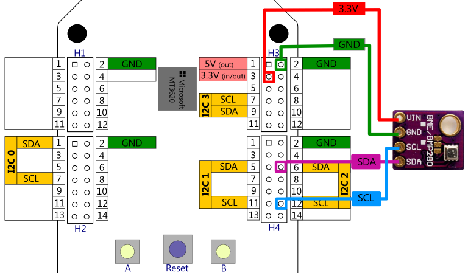

## Lab #7: Connecting an I2C sensor (Bosch BME280) and send telemetry to Azure IoT Central

In this lab we will connect an I2C based sensor and send telemetry data to **Azure IoT Central**. In this example it is the 
Bosch BME280 temperature/humidity/pressure sensor.

The libBME280 project contains a wrapper library based on the original [Bosch driver](https://github.com/BoschSensortec/BME280_driver) for the 
Bosch BME280 temperature-, humidity- and pressure-sensor.

This sensor is e.g. available as [Seeed Groove BME280 sensor board](http://wiki.seeedstudio.com/Grove-Barometer_Sensor-BME280/) amongst other suppliers.

### Wiring the BME280 sensor

There are multiple sensor boards for the BME280 available (the Seeed Grove BME280 mentioned above looks slightly different but offers to use a Grove connector cable)
but essentially they all have the necessary power supply V(in) & GND and the I2C Pins *SDA* for data and *SCL* for clock called out on the printout.

| Purpose  | MT3620           |  BME280  | Pictured wire below |
|----------|------------------|:--------:|:-------------------:|
|Ground    | Header 3, pin 2  | Gnd      | green               |
|3.3 volts | Header 3, pin 3  | Vin/Vcc  | red                 |
|Data      | Header 4, pin 6  | SDA      | purple              |
|Clock     | Header 4, pin 12 | SCL      | blue                |



In contrast to Azure IoT Hub (being a *Platform as a Service*/PaaS), Azure IoT Central is a complete
*Software as a Service*/SaaS solution. However, it is obviously built using existing PaaS 
services such as Azure IoT Hub, Azure IoT Device Provisioning Service amongst others 
but hides the individual building blocks under the hood.

With Azure Sphere this raises a specific question: **Where do you get the actual IoT Hub DNS-name and the DPS Scope ID to add as 
capability settings in the *appmanifest.json* and provision the ?**

Fortunately the Azure Sphere product group has a tool available that unveils all that information for you. Please check the 
[Azure IoT Sample github repo](https://github.com/Azure/azure-sphere-samples/tree/master/Samples/AzureIoT) .
In the [Tools directory](https://github.com/Azure/azure-sphere-samples/tree/master/Samples/AzureIoT/Tools) You will find a tool called
`ShowIoTCentralConfig.exe` that nicely extracts all that information from IoT Central similar to the following:

<p style="background-color:black;color:white;left-indent:20px">
C:\Repos\azure-sphere-samples\Samples\AzureIoT\Tools>ShowIoTCentralConfig.exe<br />
Tool to show Azure IoT Central configuration for Azure Sphere applications<br /><br />
Are you using a Work/School account to sign into your IoT Central Application (Y/N) ?Y<br />
Getting your IoT Central applications<br />
IoT Central applications:<br />
1: My Azure Sphere IoT Central App<br />
2: IoT in Action App<br />
Select (1-2) >1<br />
Getting the Device Provisioning Service (DPS) information.<br />
Getting a list of IoT Central devices.<br /><br />
Find and modify the following lines in your app_manifest.json:<br />
<span style="background-color:blue;">"CmdArgs": [ "0ne0003E5B3" ],<br />
"AllowedConnections": [ "global.azure-devices-provisioning.net", "iotc-fa52149d-5584-4424-8189-f36d910f5902.azure-devices.net" ],<br />
"DeviceAuthentication": "--- YOUR AZURE SPHERE TENANT ID--- ",</span><br /><br />
Obtain your Azure Sphere Tenant Id by opening an Azure Sphere Developer Command Prompt and typing the following command:
'Azsphere tenant show-selected'
</p>

## Seting up Azure IoT Central
Before we get there, we first need to add an application to Azure oT Central. The 
Azure Sphere Documentation has an extensive description on how to set it up under 
[Set up Azure IoT Central to work with Azure Sphere](https://docs.microsoft.com/en-us/azure-sphere/app-development/setup-iot-central
).

Apart from creating the IoT Central application itself, the remaining steps will look fairly familiar: 
Setting up the certificate chain for DPS inside Azure IoT Central.

There is also an extensive documentation on how to configure the IoT Central application on
the expected telemetry, event etc. available on [Run the sample with Azure IoT Central](https://github.com/Azure/azure-sphere-samples/tree/master/Samples/AzureIoT#run-the-sample-with-azure-iot-central).

To stretch your brain a bit, look at the source code of [*main.c*](./SphereBME280/main.c) to see what telemetry
it implements, what events, and what properties it supports (pls. note the different
format of the Device Twin desired property). A couple hints:

Looking at [*main.c* Line 100](./SphereBME280/main.c#L100) 
```C
static const char cstrJsonTelemetry[] = "{\"temperature\":%0.2f,\"pressure\":%0.2f,\"humidity\":%0.2f}";
static const char cstrJsonEvent[] = "{\"%s\":\"occurred\"}";
...
static const char cstrEvtButtonB[] = "buttonB";
static const char cstrEvtButtonA[] = "buttonA";
```
you can likely deduct the schema for the telemetry data looking like: 
```json
{
	"temperature" : 36.34,
	"pressure" : 1096.35,
	"humidity" : 45.25
}
```
and the two events being called `buttonA` and `buttonB`.

To raise an event with Azure IoT Central, you need to send a device-to-cloud message with 
the event-name as property-name and provide some arbitrary value; i.e. to raise 
the `buttonA`-event the json needs to look like: 
```json
{ "buttonA" : "occurred" }
```
and to raise the `buttonB`-event, the json would be
```json
{ "buttonB" : "occurred" }
```

Azure IoT Central also supports properties, that are actually based on Device Twin Desired Properties. 
In the previous examples we've used the short json notation (e.g. `{ "LedBlinkRateProperty" : 1 }` ).  
Azure IoT Central already partially implements Azure IoT Plug&Play. The schema therefore changes to *LedBlinkRateProperty.value*:
```json
{
	"LedBlinkRateProperty" : {	
		"value" : 1
	}
}
```  
which is reflected in the json-path in [*main.c* Line 270](./SphereBME280/main.c#L270) 
```C
/// <summary>
///     Device Twin update callback function, called when an update is received from the Azure IoT
///     Hub.
/// </summary>
/// <param name="desiredProperties">The JSON root object containing the desired Device Twin
/// properties received from the Azure IoT Hub.</param>
static void DeviceTwinUpdate(JSON_Object *desiredProperties)
{
	static const char cstrValuePath[] = "LedBlinkRateProperty.value";
	if (json_object_dothas_value_of_type(desiredProperties, cstrValuePath, JSONNumber))

```


Now it's time to get cracking:

Step 1. Create a new Azure IoT Central application

Step 2. Configure the Azure Sphere certificate chain in Azure IoT Central

Step 3. Configure your Azure IoT Central App for Telemetry, Events and Properties

Step 4. Run the  [`ShowIoTCentralConfig.exe`](https://github.com/Azure/azure-sphere-samples/tree/master/Samples/AzureIoT/Tools) 
and copy&paste the settings into your *app_manifest.json*

Step 5. Run the application and see telemetry visualized in the dashboard.
> There is currently an issue with the libBME280 not delivering the correct pressure values 
> that I wasn't able to solve. If you find what's wrong, feel free to drop me a note or do a pull request with the fix.

---

[Back to root](https://github.com/JuergenSchwertl/AzureSphereSamples#Lab7)
